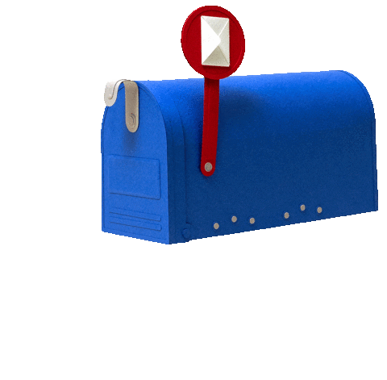

	
	 
	 

  <h1>
    Hi 
     
    , I'm Debshuvra Sarkar
  </h1>
 
  <h3>Training models and myself | ML in Progress 🚀</h3>

  

  

-  I’m currently learning **Machine Learning**, **Deep Learning** and **Gen AI**

-  How to reach me **debshuvra2005@gmail.com**

-  Ask me about: **Football, Tech, MCU**

-   Fun fact : ***I once trained a neural network to recognize my handwriting better than my professors can !*** 

</a>

## 🌐 Connect With Me

</a>

## 🛠️ Tech Stack & Tools

#### 💻 Languages  
     

#### 🌐 Frontend Development  
  

#### 🧪 Backend & Database  
  

#### 🧠 Python Libraries  
   

#### 🤖 Machine Learning and Deep Learning Libraries  
   

#### 🔧 Tools & Platforms  
   

</a>

### 📊 GitHub Stats
 
</a>

  

### ✍️ Random Dev Quote

 

### 🎶 What's Playing on my Spotify

  

<!-- Proudly created with GPRM ( https://gprm.itsvg.in ) -->

